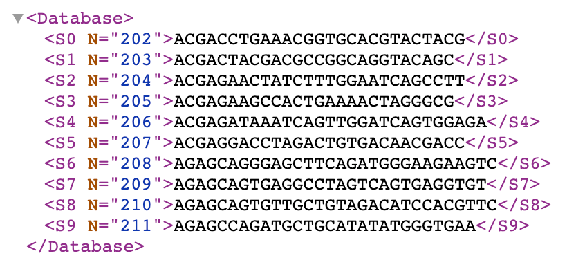
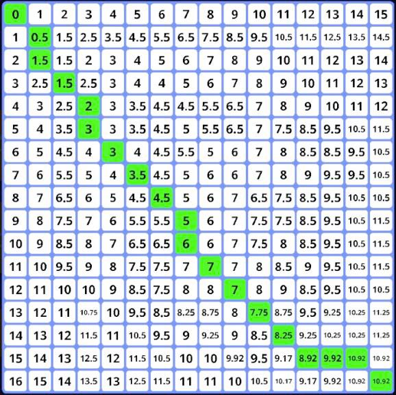

# RNA Sequencing Program
## Explanation
### Introduction
The main objective of this project is to implement a RNA sequence differencing and patching tool, which can be applied on different kinds of RNA sequence formats. This edit distance/script will be accomplished using the Wagner and Fischer algorithm.
### Implementation
Below is a sample XML file containing 10 different RNA sequences from the piRNA database. The XML file primarily stores the numerical section of the sequence’s name along with the sequence itself. This decision was taken because the alphabetical portion of the names within the piRNA database are identical and can be concatenated to the numerical portion easily. In addition, the accessions were inconsistent, meaning that only a small percentage of the database had accessions associated with the sequences. It is important to note that these decisions were taken to minimize the amount of memory taken by the database in XML format and subsequently reduce the amount of time needed to parse the XML file.

After extracting the sequence from the given xml file, the next step will be to calculate the edit distance of these two sequences. For this purpose we used Wagner & Fischer that computes the cost of the cheapest sequence of operations that can transform one sequence into another.
After computing the edit distance we move on to the next step: computing the edit script. This is computed by post-processing the edit distance matrix generate previously while computing the edit distance. In more details a raw edit script will be obtained by navigating the ED matrix from Dist[|A|,|B|] to Dist[0,0]. However to obtain the final Edit Script, costless edit operations are eliminated and the order of edit operations is inversed. This is all taken into consideration during computation as the final edit script is the only one generated once the code
terminates. The ambiguity in the RNA sequencing was dealt with using probabilities. Each pair of characters for the ambiguous decisions were computed separately. That is to say that each pair of ambiguous characters was used to compute all the possible comparison pairs. These different combinations were used to compute a “probability” value that was used to replace the cost of a change of an ambiguous character.

An image of the edit distance matrix as generated by the EditDistance script is shown below.

## To run:
Run the build.rar file found in the Build/ directory :)